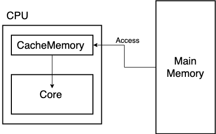
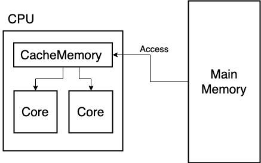
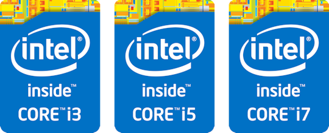
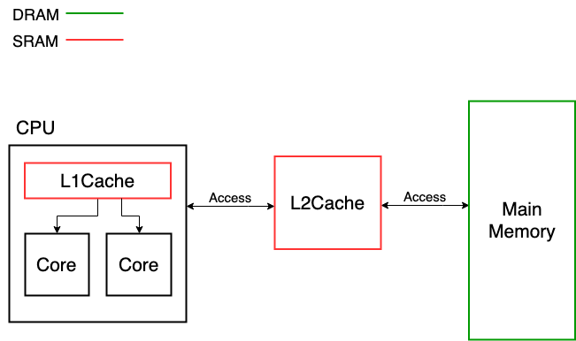

# Basic Computer Science
 

* [5大機能について](#section1)
* [演算機能](#section2)
* [記憶機能](#section3)

 

## <a id="section1" href="#section1">5大機能について</a>

コンピューターはハードウェアと呼ばれるパーツによって構成されている

パーツは大きく分けて以下の5種類に機能分けされている

* 入力 (input)
* 出力 (output)
* 記憶 (memory)
* 演算 (Calculation)
* 制御 (Control)

それぞれがお互いに協力しあってユーザーの求める処理を行なう

 

## <a id="section2" href="#section2">演算機能</a>

5大機能を動かしているのがパソコンの脳と呼ばれるCPUである 
CPUは中央演算処理装置と呼ばれ **演算** と **制御** の機能を担っている

### CPU（Central Processing Unit）：中央演算処理装置

CPUは、ユーザーの命令（入力）を処理し、求められた結果を演算処理にて（出力）する 
コンピュータなどにおいて中心的な処理装置として働く電子回路のことである。

通常、コンピュータのプログラムは、マシン語（機械語）としてメモリ上に展開されており、そのメモリ上に展開されているプログラムを実行する。

### クロックとクロック周波数

コンピュータは、クロックジェネレータと呼ばれる電子部品から発せられる、クロックと呼ばれる回路が処理の歩調をあわせるために用いるデジタルの波の信号によって動いている。

クロックとは、一定の間隔で変動するデジタル信号の波であり 
一秒間にこの波が発生する数を **クロック周波数**  と言う。

クロック周波数の単位はHz(ヘルツ)で、例えば1秒間にクロックが1000個あれば動作周波数は1kHzとなり、このとき1クロックは1000分の1秒間で発生したことになる。

マシン語の命令の処理時間はこのクロック数によって決まるため、**原則的にこのクロック周波数が大きい方が、小さいよりも処理が早くできるようになる。**

また、近年では**ターボブーストテクノロジー**という機能により、CPU のクロック数が変動するようになっている。 
例えば 3GHz の CPU でも、作業が少ない時は 2GHz で動き、逆に忙しい時は 3.6GHz で動くような仕組みである。 
よって性能表には「定格 3GHz、最大 3.6GHz」といった感じで、上限性能が併記されるのが一般的。

### CPUにおけるビット数について

CPUが内部演算回路やデータパスで扱うビット数を「ビット幅」あるいは「データパス幅」と呼ぶ。 
これはCPUが1度の処理によって扱えるデータのビット数で、4ビット、8ビット、16ビット、32ビット、64ビットと5種ほどある幅の違いに大別される。

CPUのビット数が多ければ多いほど一度に扱えるデータの量が多くなることから、**ビット数が高いほどコンピュータの性能は高い**と言える。

### CPUのメモリアクセスについて

CPUがメモリに命令やデータを読み書きを行うことを、**CPUがメモリにアクセス**すると言う。

CPUには、メモリのアドレスを指定するのに利用するアドレスバスと呼ばれるバスと、指定したアドレスのデータにアクセスするためのデータバスと呼ばれるバスがあり、それぞれのバスのビット数は、**CPUのビット数に一致する**。

つまり、32ビットCPUはデータバスおよびアドレスバスはそれぞれ最大32ビットまでの値を扱えるということである。

 

|CPUビット数|アドレスバス|メモリ容量|
|:--|--:|:--:|
|8ビット|16ビット|64kバイト|
|16ビット|20ビット|1Mバイト|
|64ビット|64ビット|16Eバイト|

 

64ビットCPUの「16Eバイト」の「E」は「エクサ」と読みペタバイトの上の容量である。

現状では16EBものメモリを必要とするような状況が想定できないため、回路量を節約するために多くの最近の64ビットPCでは、最大32GBまでといったように搭載可能なメモリ量がより小さく制限されている。

### CPUのキャッシュについて

CPUは、外部にメモリを持つだけではなく、**内部にキャッシュメモリ**と呼ばれるメモリを持っている。

通常メインメモリの処理スピードは、CPUが命令を実行するスピードより、はるかに遅いため、メモリから読み込んだ命令を直接実行していては、コンピュータは高速な演算処理が行えない。

そこで、**CPUの内部にキャッシュメモリと呼ばれる領域を持ち**、一旦ある程度の量のデータを子のメモリ領域にメインメモリからデータをコピーし、処理を実行する。 
この処理を実行する部分を、キャッシュに対して、**コア(Core)** と言う。

 

 

### CPUのコアについて

もともとコアは、１つの CPU に１つしかなかったが、2006 年頃から１つの CPU の中に、２つのコアがある**デュアルコア**が誕生する。 
また、2007年以降はコアが４つもある**クアッドコア**も登場する。

こうした複数のコアがある事を**マルチコア**と言い、マルチコアCPUは性能の表記に「3Ghz x2」や「2.6Ghz x4」など、「x2」「x4」というコアの数を表わす表記が付くことが多い。

コアが多いと、コンピューターが多くのソフトを同時に動かす時に**複数のコアで作業を分担**することが出来る。

 

 

また、一つのコアを複数のコアに見立てて処理を行う**ハイパースレッディング**という機能があれば、さらに倍の作業を実行できる。

ただ、**マルチコアはフルパワーで動いたときの消費電力は通常よりも多くなり発熱も高くなる**ためコアが多いCPUはコア１つあたりの能力を抑えていることも多い。

近年は６つや８つもコアがある CPU が普及し**ヘキサコア**や**オクタコア**などと呼ばれている。

### CPUの性能比較

ここでは上記の説明を踏まえてIntel社の3つのCPUの性能差を大雑把に比較する 
もちろんCPUの番台によっては大きく異なる場合があるので注意

 

 

* Core i7：上位型：価格は高いが高性能
* Core i5：中間型：性能も価格も中間
* Core i3：廉価型：価格が安め。コストパフォーマンス重視

具体的には、

* Core i7 はクロック数が高く、コア数も多く、ハイパースレッディングやターボブーストテクノロジーで性能が強化されていて、キャッシュも豊富。

* Core i5 の多くはハイパースレッディングがない。

* Core i3 はターボブーストがなくコアも少なめ。

このように、ハイパースレッディングやターボブーストテクノロジーの有無、クロック数やコア数でCPUの性能を把握することが出来る。

 

## <a id="section3" href="#section3">記憶機能</a>

SRAM・DRAMやHDD・SSDなどの記憶機能を担っているパーツのことである

 

 

### SRAM（Static Random Access Memory）：主記憶装置

**キャッシュメモリ** と呼ばれる

* データ読み込み時間がDRAMに比べて早い
* 構造が複雑である為、容量あたりのコストが高価
* 消費電力が低い

**SRAMにはL1キャッシュとL2キャッシュがあり、それぞれが必要な役割を担っている。**

#### L1キャッシュ

* CPU内部に配置される
* メモリの中で一番速度が早い
* 記憶領域が少ない
* 主にCPUとの直接的なアクセスに用いられる

#### L2キャッシュ

* CPU内部に配置される
* L2に比べて低速
* L2に比べて記憶領域が多い
* 主にL1キャッシュとメインメモリとのアクセスに用いられる

記憶部にフリップフロップ回路を用いており、リフレッシュ動作が不要であることから、DRAMより高速である

主に、高速な情報の出し入れが可能な点を生かしたキャッシュメモリでの使用や、低消費電力を生かした携帯型機器での使用など、比較的データ量の少ない用途によく用いられる。

低消費電力の例として、SRAMに小さな電池を内蔵あるいは外部に配置することで、主電源が供給されない間も記憶情報を保持する仕組みの不揮発メモリ（NVRAM, コンピュータの時計やBIOS設定情報の保持など）が挙げられる

情報を維持するために定期的に情報を読み出し、再度書き込みをする必要（リフレッシュ）が必要ないことからスタティック（＝静的）RAMと呼ばれるようになった

### DRAM（Dynamic Random Access Memory）：主記憶装置

**メインメモリ** と呼ばれマザーボードに配置される

* データ読み込み時間がSRAMに比べて遅い
* 構造が単縦である為、容量あたりのコストが低価
* 省電力が高い

コンデンサーに電荷を蓄える事でデータを記憶している為、時間経過による自然放電によりデータが消えてしまうことから、情報を維持するために定期的に情報を読み出し、再度書き込みをする必要がある(リフレッシュ)ことからダイナミック（＝動的）RAMと呼ばれるようになった

 

### CPUと記憶装置の間における動作方式

#### ライトバック

* 記憶処理が高速
* SRAMとDRAMの情報整合性の担保が取れない

CPUが記憶装置にデータを書き込む際、一時的にSRAMにデータを書き込み、処理の空き時間ができた際にSRAMからDRAMに書き込む方式

#### ライトスルー

* 記憶処理が低速である
* SRAMの利点を活かすことが出来ない
* SRAMとDRAMとの間でのデータが常に一致する

CPUがDRAMにデータを書き込むと同時に、SRAMにも同じ内容を書き込む方式

#### メモリインターリーブ

ブロック分けされた複数のDRAMに対して同時・並行的にアクセスすることでデータ転送速度を向上する方法

複数のメモリバンク（ブロック分けされたメモリ）に渡って連続したアドレスを交互に割り振っておき、あるデータへのアクセスで生じた遅延時間の間に次のアドレスへアクセス要求を発信する

サーバーやワークステーションなどの高い性能が要求されるシステムで用いられる場合が多いが、最近では一般ユーザー向けのPCでもメモリインターリーブが採用されている

メモリインターリーブ方式における、メモリの増設は同じ容量で同じ種類のメモリモジュールを用意しなくてはならない

 

**DRAMはSRAMに比べて大量のデータを保存することが出来るが、容量を越えるとデータは破損してしまう為、主記憶装置は補助記憶装置にデータを保存する**

 

### SSD（Solid State Drive）：補助記憶装置

* 衝撃に強く、発熱、消費電力が少ない
* 読み書きの速度が非常に速い
* 作動音がない
* HDDよりサイズが小さく、軽い
* 容量に対するコストが高価

SSDは半導体素子メモリを使ったドライブ（記憶媒体）のことを指す 
上記の特徴を始め、消費電力が少なくバッテリーの持ちがよく発熱も少なくて済むことから、ノートPCに適しており近年のでは比較的多く採用されている

ただし、SSDに用いられている「フラッシュメモリ」のデータを記録する最小単位であるセルが徐々に劣化を起こし、およそ1千～1万回程度の書き込みと消去で寿命を迎える為、毎日頻繁に大量のデータを書き換える場合などはHDDを選択するのが賢明である

### HDD（Hard Disc Drive）：補助記憶装置

* 消費電力が大きい
* 衝撃に弱い
* 容量に対するコストが低価

HDDはデータやプログラムなどを電磁的に読み書きする記憶装置 
中にデータを記録する磁性体が塗られた円盤（プラッタ）が複数枚入っており、磁気ヘッドで書き込み・読み出しをする仕組みである 
HDDに大きな衝撃が加わると、プラッタとヘッドが強く接触し、プラッターの表面に薄くコーティングされている磁性体に傷が付き、その一部がプラッターから剥がれ落ちると **不良セクタ** と呼ばれる状態になり、破損やデータ消失や動作不良を引き起こす

ただし、HDDは不良セクタが存在しても動き続ける為、状態は悪循環化してしまう 
HDDは定期的に検査を実施し不良セクタが多く存在した場合は交換するのが妥当である

